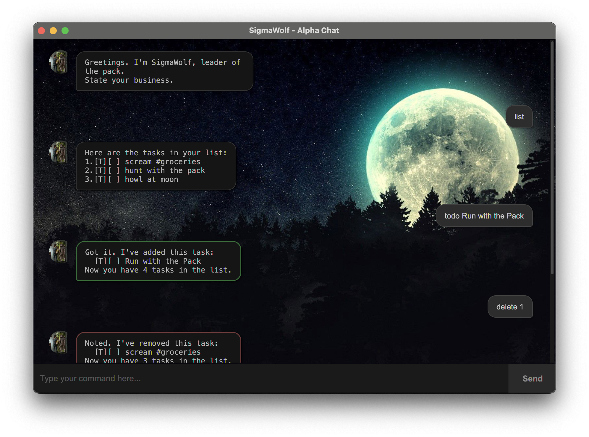

# SigmaWolf User Guide



SigmaWolf is a **task management chatbot** with an alpha wolf personality. It helps you track todos, deadlines, and events through a simple chat interface.

## Quick Start

1. Ensure you have **Java 17** or above installed.
2. Download the latest `.jar` file from the [releases page](https://github.com/KeeZhiSong/ip/releases).
3. Copy the file to the folder you want to use as the home folder.
4. Open a terminal, navigate to that folder, and run:
   ```
   java -jar sigmawolf.jar
   ```
5. Type commands in the text field and press **Send** (or hit Enter).

Your data is saved automatically to `./data/sigmawolf.txt`.

---

## Features

> **Notes about the command format:**
> - Words in `UPPER_CASE` are parameters to be supplied by you.
> - Date format is `yyyy-MM-dd HHmm` (e.g., `2026-03-01 1800`).
> - Non-existent dates (e.g., Feb 30) will be rejected.
> - Task `INDEX` refers to the number shown in the `list` command.
> - Descriptions cannot contain the `|` character.

### Adding a todo: `todo`

Adds a task with no date.

Format: `todo DESCRIPTION`

Example:
```
todo read book
```
```
Got it. I've added this task:
  [T][ ] read book
Now you have 1 tasks in the list.
```

### Adding a deadline: `deadline`

Adds a task with a deadline.

Format: `deadline DESCRIPTION /by DATE`

Example:
```
deadline submit report /by 2026-03-01 1800
```
```
Got it. I've added this task:
  [D][ ] submit report (by: Mar 01 2026 18:00)
Now you have 2 tasks in the list.
```

### Adding an event: `event`

Adds a task with a start and end time. The start time must be before the end time.

Format: `event DESCRIPTION /from DATE /to DATE`

Example:
```
event team meeting /from 2026-03-01 1400 /to 2026-03-01 1600
```
```
Got it. I've added this task:
  [E][ ] team meeting (from: Mar 01 2026 14:00 to: Mar 01 2026 16:00)
Now you have 3 tasks in the list.
```

### Listing all tasks: `list`

Shows all tasks in your list.

Format: `list`

Example:
```
Here are the tasks in your list:
1.[T][ ] read book
2.[D][ ] submit report (by: Mar 01 2026 18:00)
3.[E][ ] team meeting (from: Mar 01 2026 14:00 to: Mar 01 2026 16:00)
```

### Marking a task as done: `mark`

Marks a task as completed.

Format: `mark INDEX`

Example:
```
mark 1
```
```
Nice! I've marked this task as done:
  [T][X] read book
```

### Marking a task as not done: `unmark`

Marks a completed task as not done.

Format: `unmark INDEX`

Example:
```
unmark 1
```
```
OK, I've marked this task as not done yet:
  [T][ ] read book
```

### Deleting a task: `delete`

Removes a task from the list.

Format: `delete INDEX`

Example:
```
delete 1
```
```
Noted. I've removed this task:
  [T][ ] read book
Now you have 2 tasks in the list.
```

### Finding tasks by keyword: `find`

Searches for tasks whose descriptions contain the given keyword (case-insensitive).

Format: `find KEYWORD`

Example:
```
find meeting
```
```
Here are the matching tasks in your list:
1.[E][ ] team meeting (from: Mar 01 2026 14:00 to: Mar 01 2026 16:00)
```

### Tagging a task: `tag`

Adds a tag to a task. Tags must be a single word and cannot contain `|`, `,`, or `#`.

Format: `tag INDEX #TAGNAME`

Example:
```
tag 1 #urgent
```
```
Tagged task: [D][ ] submit report (by: Mar 01 2026 18:00) #urgent
```

### Removing a tag: `untag`

Removes a tag from a task.

Format: `untag INDEX #TAGNAME`

Example:
```
untag 1 #urgent
```
```
Removed tag from task: [D][ ] submit report (by: Mar 01 2026 18:00)
```

### Exiting the program: `bye`

Exits the chatbot.

Format: `bye`

---

## Command Summary

| Action | Format |
|--------|--------|
| Todo | `todo DESCRIPTION` |
| Deadline | `deadline DESCRIPTION /by DATE` |
| Event | `event DESCRIPTION /from DATE /to DATE` |
| List | `list` |
| Mark | `mark INDEX` |
| Unmark | `unmark INDEX` |
| Delete | `delete INDEX` |
| Find | `find KEYWORD` |
| Tag | `tag INDEX #TAGNAME` |
| Untag | `untag INDEX #TAGNAME` |
| Exit | `bye` |
